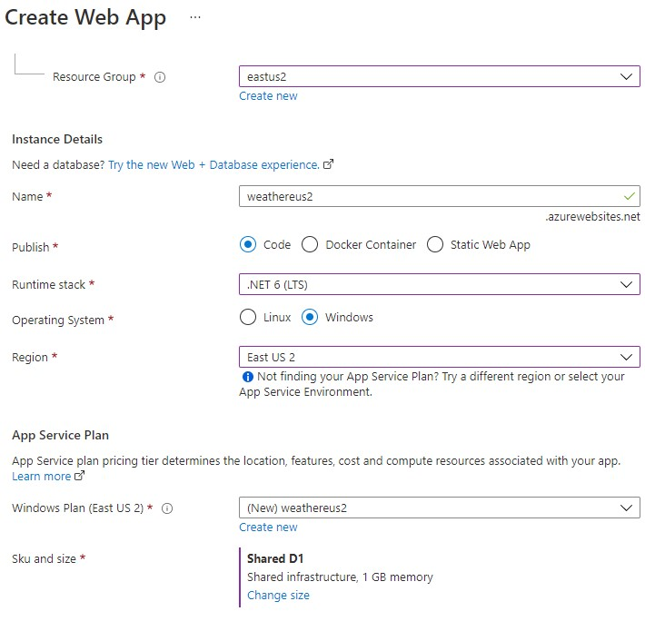

# Deployment
Deployment requires a minimum of 2 resource groups in 2 different availability zones. For this example, East US 2 and West US 2 were used.

The following resources are needed in both availability zones:
1)	Azure Cognitive Search Index
2)	Key Vault (To store the secret to access Search Index)
3)	Azure Web App (To host the sample application)
4)	Managed Identity (For the web job to access the Key Vault)
5)	An Event Hub Namespace.
6)  Storage account (For event hub checkpoints)

## Event Hub Namespace configuration
Before getting started, we will need to designate one of our Event Hubs namespaces as a "primary" namespace.
The other Event Hub namespaces will be referred to as "secondary".
It is important to note that the secondary node chosen **cannot** have any existing Event Hubs in it.
If they are any present, proceed to delete all of them.

Create an Event Hub with the name "city-temperature"

Create two consumer groups for the event hub. Example `index-worker-{region}`.
Add another consumer group `localtest` for your local machine.

**Important:** Add the User Managed Identities of the application in **both** regions with the assignment role `Azure Event Hubs Data Receiver` to the EventHubs in both regions.
The event hub alias will display as inherited permission as below.

Add yourself the 'Azure Event Hubs Data Owner' role so that your local development will 
be able to connect to the event hub.

## Key Vault configuration

Add a secret to Key Vault in each region.

|Name|Value|
| --- | --- |
|SearchServiceKey| Search Index key for the respective region|

Go to KeyVault `Access Policies` and  `Add Access Policy`.
Associate the managed identity of the Event Hub pairing with the Key Vault, with `Get` and `List` permission for `Secret Management Operations`.

## Storage account configuration
Add the managed identity as `Storage Blob Data Contributor` in `Access Control (IAM)`

## Azure App Service configuration
### **Create an App Service**

Example:

The following settings must be set and the values will be different in each region.

|Key|Value|
| --- | --- |
|AZURE_CLIENT_ID| Client ID of the Managed Identity|
|environmentSettings:region|Respective region like wus2 & eus2|
|keyVaultSettings:keyVaultName|Key Vault name|
|eventHubSettings:eventHubNamespace| Event hub alias namespace |
|eventHubSettings:regionSpecificBlobStorageUri| URI to region specific blob storage|
|searchServiceSettings:ServiceUri| URI to region specific search index|

Example:

Associate the Managed Identity.

### **Deploy application to App Service**

Deploy your application. For this example, we will be deploying a WebJob to our App Service.

[SearchIndexUpdateWebJob.zip](../SearchIndexUpdateWebJob/PublishOutput/SearchIndexUpdateWebJob.zip)

Once you have repeated the process for both regions, your setup is complete.
You can run the `WeatherStation` console application from your local machine and see it in action.
Search indecies in both regions should get updated almost immediately as the console application sends new data.
