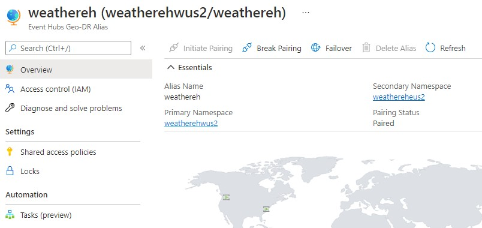
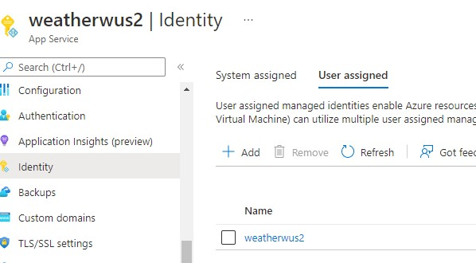

# Deployment
Deployment requires two resource groups in two different zones. I used East US 2 and West US 2.

The following resources are needed in both the regions.
1)	Azure Cognitive Search Index
2)	Key Vault (To store the secret to access Search Index)
3)	Azure Web App (To host the web job)
4)	Managed Identity (For the web job to access the Key Vault)
5)	Event Hub Geo Paired with both the regions.
6)  Storage account (For event hub checkpoints)

## Event Hub Namespace configuration
Make sure the event hub namespace is Geo Paired first so that 
the action below will affect both the event hubs. You also need to take the action
on the primary node so that it gets reflected on the secondary node.

Example:

Create an Event Hub with name "city-temperature"

Create two consumer groups to the event hub like `index-worker-{region}`.
Add a consumer group localtest for running on your local machine.

**Important:** Add User Managed Identity of **both** regions as `Azure Event Hubs Data Receiver` in both regions.
The event hub alias will show both as inherited permission.

Add yourself the 'Azure Event Hubs Data Owner' role so that your local development will 
be able to connect to the event hub.

## Key Vault configuration

Add a secret to Key Vault in each region.

|Name|Value|
--- | --- | ---|
|SearchServiceKey| Search Index key for the respective region|

Go to KeyVault `Access Policies` and  `Add Access Policy`.
Associate managed identity with Key Vault with `Get` and `List` permission for secrets.

## Storage account configuration
Add the managed identity as `Storage Blob Data Contributor` in `Access Control (IAM)`

## Azure App Service configuration
**Create web app**

Example:

The following settings must be set and the values will be different in each region.

|Key|Value|
--- | --- | ---|
|AZURE_CLIENT_ID| Client ID of the Managed Identity|
|environmentSettings:region|Respective region like wus2 & eus2|
|keyVaultSettings:keyVaultName|Key Vault name|
|eventHubSettings:eventHubNamespace| Event hub alias namespace |
|eventHubSettings:regionSpecificBlobStorageUri| URI to region specific blob storage|
|searchServiceSettings:ServiceUri| URI to region specific search index|

Example:

Associate the Managed Identity.

Install the webjob by uploading the zip file created by the SearchIndexUpdateWebJob Release build located at
[SearchIndexUpdateWebJob.zip](../SearchIndexUpdateWebJob/PublishOutput/SearchIndexUpdateWebJob.zip)

